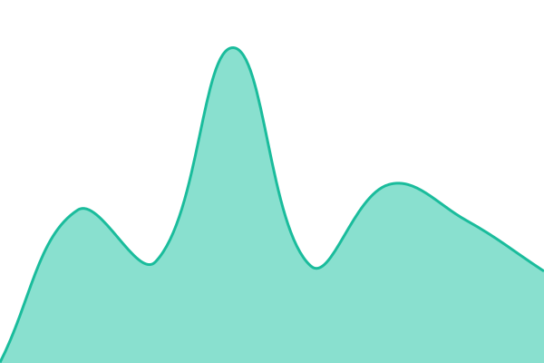
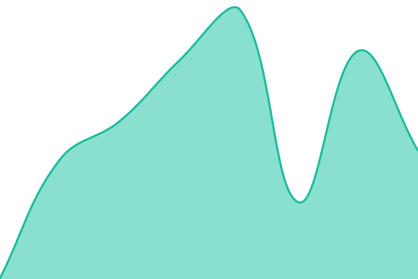
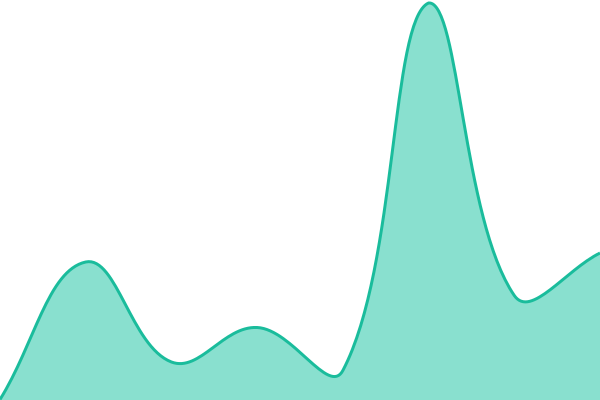

# [📈 Live Status](https://status.nuller.jp): <!--live status--> **🟧 Partial outage**

This repository contains the open-source uptime monitor and status page for [Nuller-Team](https://status.nuller.jp), powered by [Upptime](https://github.com/upptime/upptime).

With [Upptime](https://upptime.js.org), you can get your own unlimited and free uptime monitor and status page, powered entirely by a GitHub repository. We use [Issues](https://github.com/Nuller-Team/uptime_js/issues) as incident reports, [Actions](https://github.com/Nuller-Team/uptime_js/actions) as uptime monitors, and [Pages](https://status.nuller.jp) for the status page.

<!--start: status pages-->
<!-- This summary is generated by Upptime (https://github.com/upptime/upptime) -->
<!-- Do not edit this manually, your changes will be overwritten -->
<!-- prettier-ignore -->
| URL | Status | History | Response Time | Uptime |
| --- | ------ | ------- | ------------- | ------ |
|  [N/S Apps](https://n-s-apps.nuller.jp/) | 🟥 Down | [n-s-apps.yml](https://github.com/Nuller-Team/uptime_js/commits/HEAD/history/n-s-apps.yml) | 

 596ms
     
 | 

<a href="https://status.nuller.jp/history/n-s-apps">94.88%</a>
    

|  [Nuller Apps](https://app.nuller.jp/) | 🟥 Down | [nuller-apps.yml](https://github.com/Nuller-Team/uptime_js/commits/HEAD/history/nuller-apps.yml) | 

 272ms
     
 | 

<a href="https://status.nuller.jp/history/nuller-apps">0.00%</a>
    

|  [Nuller Blog](https://blog.nuller.jp/) | 🟩 Up | [nuller-blog.yml](https://github.com/Nuller-Team/uptime_js/commits/HEAD/history/nuller-blog.yml) | 

 225ms
     
 | 

<a href="https://status.nuller.jp/history/nuller-blog">100.00%</a>
    

|  [Nuller.JP](https://nuller.jp/) | 🟩 Up | [nuller-jp.yml](https://github.com/Nuller-Team/uptime_js/commits/HEAD/history/nuller-jp.yml) | 

 191ms
     
 | 

<a href="https://status.nuller.jp/history/nuller-jp">100.00%</a>
    

<!--end: status pages-->

[**Visit our status website →**](https://status.nuller.jp)

## 📄 License

- Powered by: [Upptime](https://github.com/upptime/upptime)
- Code: [MIT](./LICENSE) © [Anand Chowdhary](https://anandchowdhary.com), supported by [Pabio](https://pabio.com)
- Data in the `./history` directory: [Open Database License](https://opendatacommons.org/licenses/odbl/1-0/)
